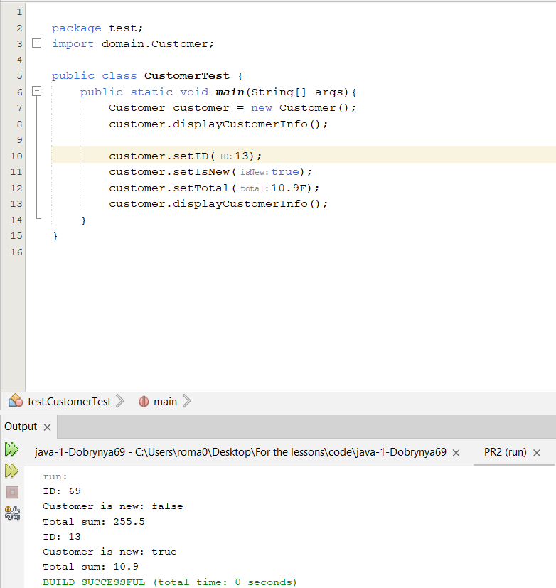

#### Класс Customer
```java
package domain;

public class Customer {
    
    public Customer(){
        this.ID = 69;
        this.isNew = false;
        this.total = 255.5F;
    }
    
    private int ID;
    private boolean isNew;
    private float total;
    
    public void displayCustomerInfo(){
        System.out.println("ID: " + this.ID);
        System.out.println("Customer is new: " + this.isNew);
        System.out.println("Total sum: " + this.total);
    }
    
    public int getID(){
        return this.ID;
    }
    
    public void setID(int ID){
        this.ID = ID;
    }
    
    public boolean getIsNew(){
        return this.isNew;
    }
    
    public void setIsNew(boolean isNew){
        this.isNew = isNew;
    }
    
    public float getTotal(){
        return this.total;
    }
    
    public void setTotal(float total){
        this.total = total;
    }
    
}

```
